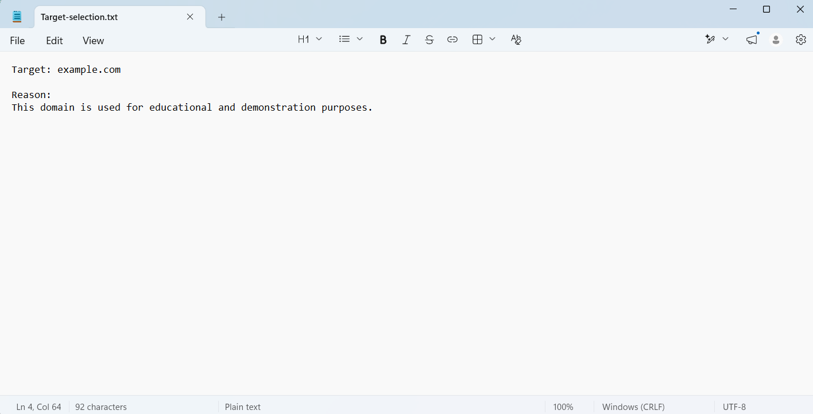
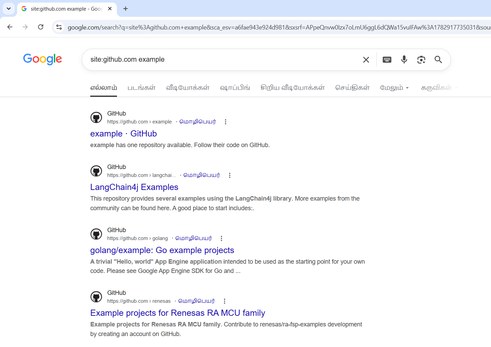
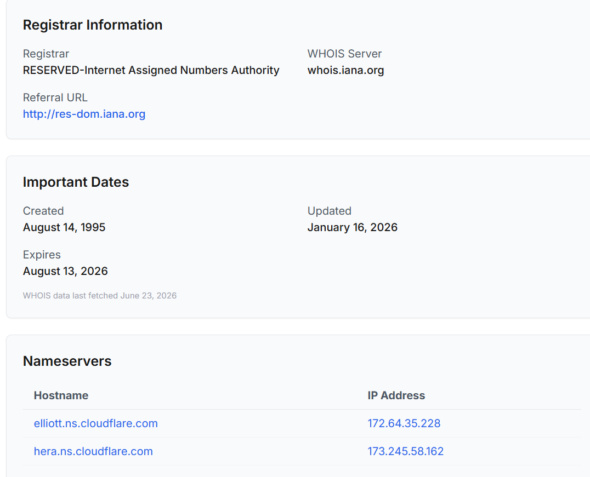
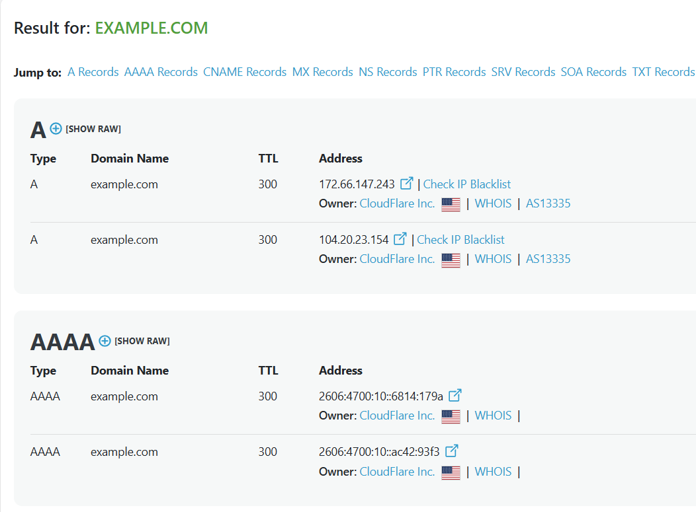
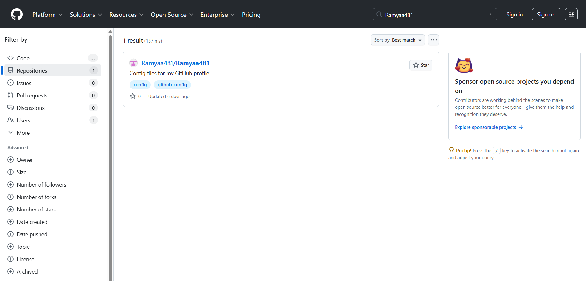
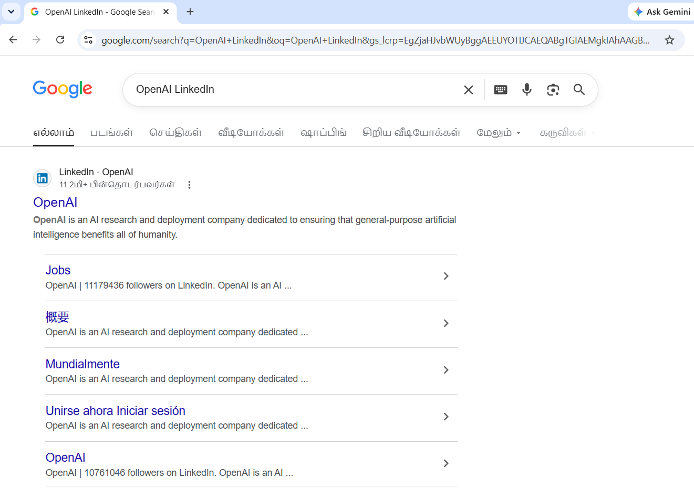
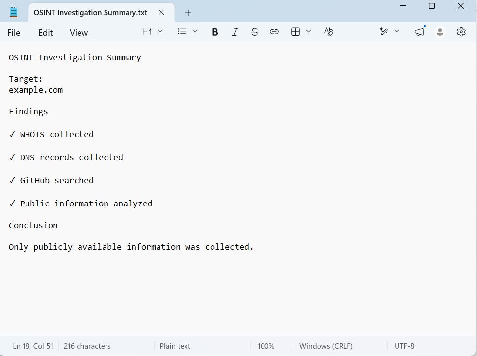

# OSINT Investigation

## Objective

Perform an Open Source Intelligence (OSINT) investigation using publicly available information.

## Tools Used

- Google
- WHOIS
- DNS Lookup
- VirusTotal
- GitHub
- Shodan

## Investigation Steps

1. Target Selection
2. Google Search
3. WHOIS Lookup
4. DNS Enumeration
5. GitHub Search
6. Social Media Analysis
7. Report Preparation

## Findings

The investigation collected publicly available information including domain registration details, DNS records, publicly available repositories, and publicly accessible online profiles.

## Screenshots

##  Target Selection

Selected **example.com** as the investigation target.

### Screenshot

##  Google Search

Performed Google search using search operators.

### Screenshot

##  WHOIS Lookup

Collected domain registration details.

### Screenshot

## DNS Records

Collected DNS records.

### Screenshot

##  GitHub Search

Searched public GitHub repositories.

### Screenshot

##  Social Media Search

Collected publicly available social media information.

### Screenshot

##  Summary

Documented the investigation findings.

### Screenshot

## Conclusion

This project demonstrates the ethical collection and analysis of open-source intelligence using freely available tools. No unauthorized access or exploitation was performed.
